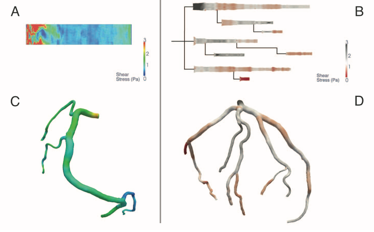
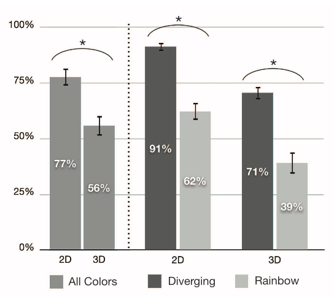
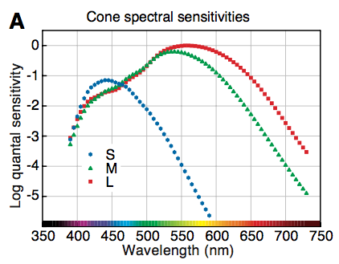
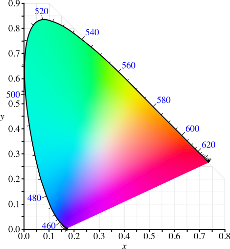
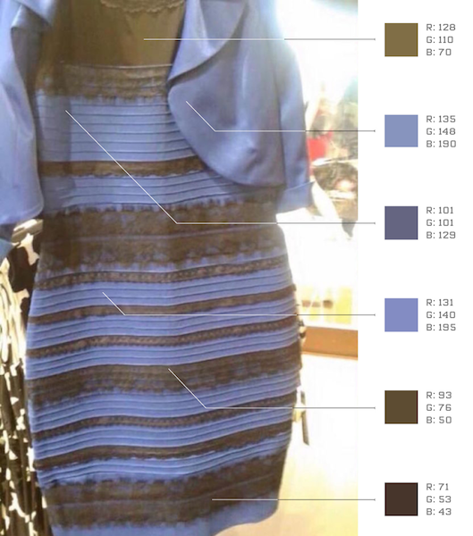
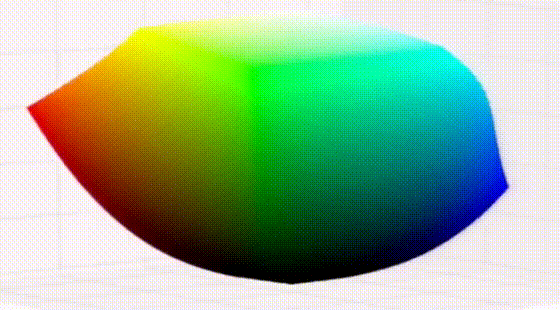
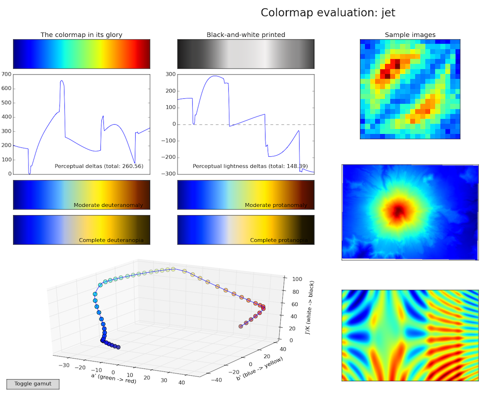
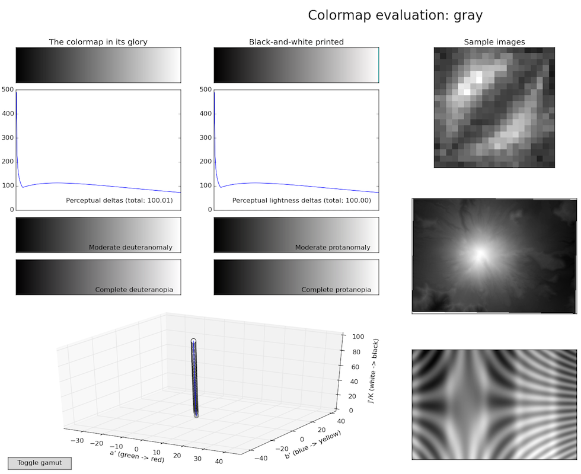
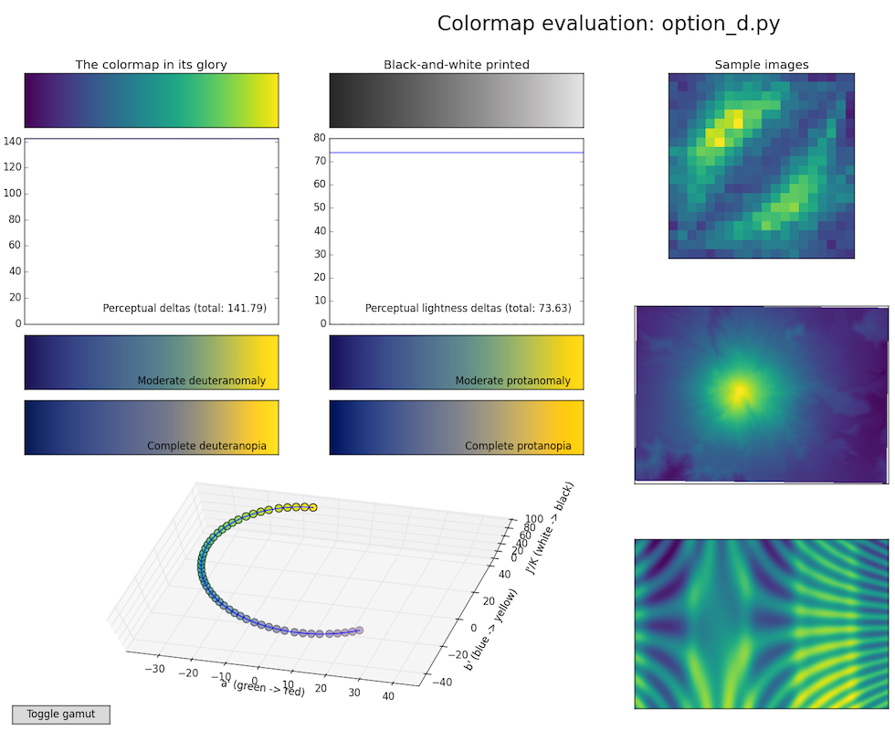

  
```{r setup, include=FALSE}
knitr::opts_chunk$set(echo = TRUE)
```

# Outline for today

- A splash of color theory
- Plotting 2D heat maps in `ggplot`
- Saving plots

# A splash of color theory

Recall the table from the work of Cleveland and McGill on distinguishing graphical elements from most to least accurately distinguishable.

|Rank | Graphical element |
|-----+-------------------|
| 1   | Positions on a common scale |
| 2   | Positions on the same but nonaligned scales |
| 3   | Lengths |
| 4   | Angles, slopes |
| 5   | Area |
| 6   | Volume, color saturation |
| 7   | Color hue |

The last two items, color saturation (dark to light) and hue, are the only color items. Even though color can be the most difficult to distinguish, a well designed color map that takes advantage of how humans perceive color can be used to display data as accurately as possible.

In order to really get a sense for how important color maps can be, lets look at the "jet" color map that used to be the standard color map in some software packages.
```{r, message = FALSE}
library(tidyverse)
library(imager)

jet.colors <-
  colorRampPalette(c("#00007F", "blue", "#007FFF", "cyan",
                     "#7FFF7F", "yellow", "#FF7F00", "red", "#7F0000"))
image(1,1:100,matrix(1:100, nrow=1), col = jet.colors(100), asp=1)
```

It seems inocurous enough in that one might assume red => high values (hot) and blue => low values (cold). However, to see that jet doesn't do a very good job at mapping high and low, one can use jet to visualize a photograph, which normally has light (hot) and dark (cold) regions. For example, here is the Mona Lisa using the jet color map.

```{r}
graymona = as.matrix(grayscale(load.image("assets/mona-lisa_color.jpg")))
image(graymona[,ncol(graymona):1], col = jet.colors(100), asp=1)
```

If that doesn't make you nauseous, it should. Any guesses for what color map would be better? Grayscale, correct! Here is the grayscale color map
```{r}
image(1,1:100,matrix(1:100, nrow=1), col = gray.colors(100))
```

and the Mona Lisa with the grayscale color map
```{r}
image(graymona[,ncol(graymona):1], col = gray.colors(100), asp=1)
```

Ok, so "jet" Mona is ugly and "gray" Mona is better, but how does this matter is "real-world" settings? Take the a study from Borkin et al. (2011) that employed different color maps in software cardiologists use to look for arteries that are at risk for disease formation. 



The figure below shows that doctors over 50% better at finding high risk arteries with the better (i.e., not "jet") color map. The wrong colors can hurt!



## Picking a better colormap

What criteria should you use to pick a better (i.e., "safer"!) color map? Here are some reasonable ones; the color map should

1. Have colors and be pretty (duh)
2. Accurately represent variation in the data ("perpetually uniform")
3. Print well in black and white
4. Be accessible to colorblind viewers

## Color theory

The biggest problem with the jet color map is that it is not "perceptually uniform". A perceptually uniform mapping maps numbers to colors so that humans can 
differentiate colors in proportion to how different the numbers are that map them. In other words, a pair of numbers that are twice as far apart as another pair should map to colors that twice as easy to distinguish compared to colors for the other pair. Picking a better color map that is perpetually uniform requires knowing a little bit about "color theory". 

Transforming data to something you see involves the following pathway:

Data ——> RGB values ——> Monitor ——> Light ——> Retina ——> Brain

0. Data ——> RGB values

    - The color map.

1. RGB values ——> Monitor

    - Light is a collection of photons of different wavelengths.
    - Monitors emit different intensities of photons of three different wavelength (red, green, and blue)

2. Light ——> Retina

    - Cone cells in the retina perceive color and come in three types with three absorption spectra (long/medium/short, LMS)

    

    - A light source hitting the eye then produces a combination of LMS values. 
    - Multiple light sources could produce the same LMS values in the retina!
    - CIE XYZ maps the sensitivities of human eye to three axes
    
    

    
3. Retina ——> Brain

    - The brain processes colors differently depending on their context
    
    
    
    - Luckily, folks interested in color have some nice color models that attempt to take into account these perceptual issues. This results in a sort of "color blob" or perceived colors. The vertical axis is dark to light, another axis is blue to yellow, and the last axis is red to green. It should be clear from the image below that some colors are perceived as "brighter" than others and the color model helps account for these kinds of effects.
    
    
    
    - Using the above color model allows one to choose colors are equally distinguishable perceptually and these colors can then be used for adjacent numerical values in a color map.

## Evaluating a few colormaps





## Making the default colormap

- To be colorblind friendly, use blue/yellow axis instead of red/green
- To be grayscale friendly, use dark to light
- Must be dark blue to light yellow  
  (no variation in the blob in the light blue to dark yellow direction)

## Viridis

Through the work of some procrastinating graduate students (Stéfan van der Walt and Nathaniel Smith, <https://www.youtube.com/watch?v=xAoljeRJ3lU>) who use the programming language **Python**, a color map was created that satisfies the above criteria and is perceptually uniform. The color map is called **viridis**.

- Latin for green
- Also it could be named after *Dendroaspis viridis* (western green mamba)


From the figure below, you can see that viridis is much better than jet and prettier than grayscale.



Plotting Mona Lisa with viridis looks like this. OMG. So much better.
```{r}
library(viridis)

image(graymona[,ncol(graymona):1], col = viridis(100), asp=1)
```

The same folks who made viridis also made some other perceptually uniform color maps in case you need some additional options: "magma", "plasma", and "inferno".
```{r}
image(graymona[,ncol(graymona):1], col = magma(100), asp=1)
image(graymona[,ncol(graymona):1], col = plasma(100), asp=1)
image(graymona[,ncol(graymona):1], col = inferno(100), asp=1)
```

# Plotting 2D heatmaps in `ggplot`

In the previous plots, we used the `image` function, which like most of R base graphics is very basic and ultimately boring. Lucky for us, images are just one kind of 2D gridded color plot and ggplot understands 2D very well. In other words, we can just plot two variables on an x-y grid and use color for third variable. 

## Raster plots

A grid of pixels, or a "raster" image, can be plotted with the `geom_raster()` function.

```{r}
ggplot(faithfuld, aes(x = eruptions, y = waiting)) + theme_bw() +
  geom_raster(aes(fill = density)) +
  scale_fill_viridis() # viridis colormap
```

The `faithfuld` data are used above, which are length of eruptions and waiting time until the next eruptions for the "Old Faithful" geyser in Yellowstone National Park. The `d` part of the data set indicates its an estimate of the probability density for each eruption length and waiting time combination.
```{r}
summary(faithfuld)
```

The pixelation above is natural due to the scale of the data, but you can smooth this by "interpolating" with the `interpolate` option.
```{r}
ggplot(faithfuld, aes(waiting, eruptions)) + theme_bw() +
  geom_raster(aes(fill = density), interpolate = TRUE) +
  scale_fill_viridis()
```

If you don't want the squares to be of equal size or want to draw rectangles of any size, then you can use either `geom_tile()` or `geom_rect()`.

## Adding contours

You can also add a contour plot on top of the heat map. The `geom_contour()` function needs to know what the `z` variable or height is as well as the `x` and `y` variables.
```{r}
ggplot(faithfuld, aes(waiting, eruptions)) + theme_bw() +
  geom_raster(aes(fill = density)) +
  scale_fill_viridis() +
  geom_contour(aes(z = density), color = "white")
```

The contours can be colored by their level as well.
```{r}
ggplot(faithfuld, aes(waiting, eruptions)) + theme_bw() +
  geom_raster(aes(fill = density)) +
  scale_fill_viridis() +
  geom_contour(aes(z = density, color = stat(level))) +
  scale_color_viridis(option = "magma")
```

Finally, you can specify contours at specific levels with the `breaks` option.
```{r}
ggplot(faithfuld, aes(waiting, eruptions)) + theme_bw() +
  geom_raster(aes(fill = density)) +
  scale_fill_viridis() +
  geom_contour(aes(z = density), breaks=c(0.01, 0.02, 0.03))
```

## Histograms and density estimates

The `faithfuld` data are kernel density estimates (KDEs) from a list of eruption times and waiting times. Recall that KDEs are just a way of adding together normal distributions to approximate your data. The underlying data for the Old Faithful eruptions don't actually cover the whole range plotted above; rather they look like this:
```{r}
head(faithful)
```

These data can be displayed with a 2D histogram using `geom_bin2d()`
```{r}
ggplot(faithful, aes(waiting, eruptions)) + theme_bw() +
  geom_bin2d() +
  scale_fill_viridis()
```

or using possibly aesthetically more pleasing hexagonal bins with `geom_hex()`
```{r}
ggplot(faithful, aes(waiting, eruptions)) + theme_bw() +
  geom_hex() +
  scale_fill_viridis()
```

Obtaining a kernel density estimate from these data can be done with the function `geom_density_2d()`, which produces contours by default.
```{r}
ggplot(faithful, aes(waiting, eruptions)) + theme_bw() +
  geom_density_2d() +
  geom_point() +
  scale_fill_viridis()
```

To get the full density values that you can plot like a heat map, you need to swtich to the function `stat_density_2d`. The main difference between `stat_density_2d` and `geom_density_2d` is that `stat_density_2d` will give you access to the imputed "density" values generated from the KDE. Using `stat_density_2d` below, we turn the contours off and then set the `geom` parameter of `stat_density_2d` to "raster".
```{r}
ggplot(faithful, aes(waiting, eruptions)) + theme_bw() +
  stat_density_2d(geom = "raster", aes(fill = stat(density)), contour = FALSE) +
  geom_point() +
  scale_fill_viridis()
```

The upshot here is that you can use the `stat_density_2d` function to impute (or guesstimate) values you didn't actually measure using a KDE. Then you can plot a nice 2D heatmap. Fun!

# Saving plots

Its really shocking we've left this until now, but one of the most important things you will do with your plots is save them. In `ggplot2`, the function `ggsave()` will save the most recent plot to disk. The last name you give the file determines the file type.
```{r, eval=FALSE}
ggsave("faithful.jpg")
```

You can also save a specific plot that you have saved.
```{r, eval = FALSE}
fp = ggplot(faithfuld, aes(waiting, eruptions)) + theme_bw() +
  geom_raster(aes(fill = density), interpolate = TRUE) +
  scale_fill_viridis()

ggsave("faithful.jpg", fp)
```

## Sizing plots

The size of the figure will be taken from the size of the "device", which means that it will have some default value. You can change this by specifying options to `ggsave()` such as

- width, height: plot dimensions
- scale: multiplicative scaling factor for plot size
- dpi: resolution used for raster outputs (e.g., 300 for nice printed pictures)

It can be helpful to see what the size of the plots are before saving them; for example, you may want to know the font size is right for the tick labels. To do this, you can give the `fig.width` and `fig.height` options to the `R chunk`. 

```{r, fig.width=3, fig.height=2}
ggplot(faithfuld, aes(waiting, eruptions)) + theme_bw() +
  geom_raster(aes(fill = density), interpolate = TRUE) +
  scale_fill_viridis()
```


## Vector vs raster graphics

It should be clear by now that "raster" graphics are those that plot data as individual pixels. You can save your plots as "raster" data too, which simply means an image format like ".png" or ".jpg". This is great for heat maps and color gradients, but it can be awful for smooth line plots and fonts. In addition, raster formats can results in large file sizes if you need the figure to print at a large size.

The solution to this is to use a "vector" graphics format such as ".pdf", ".eps", or ".svg". These formats save the curves as points and equations that are then drawn on screen. Thus, these plots can have a small file size while allowing one to continuously zoom into the plot. To see what a plot saved as ".pdf" looks like, save a contour plot.
```{r, eval=FALSE}
ggplot(faithful, aes(waiting, eruptions)) + theme_bw() +
  geom_density_2d() +
  geom_point()

ggsave("faithful.pdf")
```

One word of warning here is that saving a heat map as a ".pdf" may still result in a raster graphic since elements of the graphic cannot be produced as points and lines.

# Lab 

### Problems

1. Create a heat map of the "babak-etal-2015_imprinted-mouse_tidy.csv" data.
    - Use a perceptually uniform color map
    - Resize the figure so the tick labels are readable
    - Add appropriate plot title and axes labels
    - Save the figure as ".pdf" and **include the .pdf** in the **.zip** that you submit
    
2. Load the GWAS data using the commands below:

```{r, eval=FALSE}
gwas = read_tsv("gwas_catalog_v1.0.2-associations_e93_r2018-09-18_top40.tsv", na=c("NA", "NR"))
gwas = gwas %>% mutate(risk_allele_freq = parse_double(str_extract(gwas$`RISK ALLELE FREQUENCY`, "0\\.\\d+")))
```

    - Choose one **disease** to compare against "Height"
    - For both your disease of choice and for "Height", create a 2D density plot (use the `stat_density_2d` function so that unknown values are imputed with a KDE)
    - Plot `risk_allele_freq` on the x-axis and `PVALUE_MLOG` on the y-axis
    - Use a perceptually uniform color map
    - Add appropriate plot title and axes labels
    - Save the figure as ".pdf" and **include the .pdf** in the **.zip** that you submit
    - +2 Extra Credit: play with the limits of the y-axis to get a better view of the highly significant SNPs. \
      What can you say about the difference between the allele frequency of significant SNPs for a disease and for height?