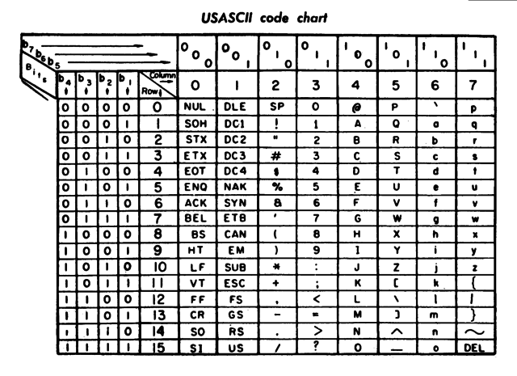

  
```{r setup, include=FALSE}
knitr::opts_chunk$set(echo = TRUE)
```

# Outline for today

- Text basics
- Basic string manipulation using `stringr`
- Regular expressions: basics
- Regex: character classes
- Regex: quantifiers
- Regex: grouping
- Regex: replacing matches
- Regex: practice!

# Text basics

Working with text and strings can feel like the most boring and tedious aspect of data analysis and wrangling, but it is often important and sometimes the most crucial element. Not only are data sets often untidy, but they are also often full of quirks related to how the data was initially entered. For example, categorical variables, like a country name, might be mixed with numerical variables, such as dates or population sizes, and these must then be separated intelligently in order to be further analyzed in R. String analysis tools are crucial for this task. The first tool you will use includes functions from the `stringr` package. The second tool, more difficult but arguably the most crucial, is the "regular expression", which is the like a Swiss Army knife for finding patterns in text.

## `stringr`

R comes with some base functions for manipulating text, but these can be inconsistent in terms of their arguments and their outputs. As normal for material in this course, Hadley Wickham comes to the rescue with a package, `stringr` that provides some basic function for manipulating strings and for using regular expressions. All the functions start with `str_`, which makes seeing a list of them easy using the "tab complete" functionality in RStudio. While it is certainly useful to learn the base packages for string manipulation, the hope is that learning a simpler framework with `stringr` can make the concepts easier so that if you need to understand how to work one of the base functions, the task will be easier.

## Encoding

Computers store information in bits and while it can seems intuitive to convert bits to numbers (go from base 2 to base 10), converting bits to text requires some arbitrary choices. How many characters can convert to bits? While special characters (e.g., ?, !, ^, etc) do you include beyond numbers and digits? Once you settle on which characters to include, you can simply list them in a table with the corresponding binary value that represents them. Initially, since English speakers were the dominant users of computers, this table, or "encoding", was ASCII and encoding only 128 characters.



Since 128 characters is not enough to encode characters found in many foreign languages (particularly those with non-Roman characters), other encodings exist that do much better. The main encoding using on the internet now is "Unicode", which contains a repertoire of more than 128,000 characters covering 135 modern and historic scripts. The most common variant of Unicode is "UTF-8", which was designed for backward compatibility with ASCII.

As more and more computer software moves to use UTF-8 as the default encoding, encoding will become something users don't have to worry about. However, in some cases software, including older R functions, may read into text expecting ASCII or some limited encoding when text is actually UTF-8. This means that some or all of the text will look mangled, say like this:

> ÉGÉìÉRÅ[ÉfÉBÉìÉOÇÕìÔǵÇ≠ǻǢ

There are some ways to fix this kind of problem. Jeny Bryan discusses some of these solutions here <http://stat545.com/block032_character-encoding.html> and more generally gives some examples of how to convert from one encoding to another. For the purpose of learning more about text wrangling, assume that everything is in UTF-8 and that you do not have to convert anything!

## Creating strings: quotes and special characters

Creating strings is easy: just use quotes, single or double.

```{r}
iamstring = "I am very worried about the country right now."
alsostring = 'So very very worried'

print(iamstring)
print(alsostring)
```

Including a quote within a string is easy if you mix the quote styles.

```{r}
print("A 'quote' within a quote")
print('Another "quote" within a quote')
```

Note in the second example how R converted the single quotes defining the string to double quotes and put backslashes before the double quotes inside the string? This is how you can tell R to ignore the special function of a character in a string if it has one. Within a double quoted string, a double quote would mean "end of the string". Putting a backslash before the double quote says "this is just a double quote character." Generally, putting a backslash before a character in a string "*escapes*" the character. Other special "escape characters", which are often characters you can't type with the keyboard easily, include tab, "\t", and the end-of-line character, "\n".

```{r}
cat("at a tab separates this\tand\tthis\n")
cat("\n")
cat("creating multiple lines\nis easy with end-of-line\ncharacter")
```

# Basic string manipulation using `stringr`

First, load `stringr`.

```{r}
library(stringr)
```

### Length

The function `str_length()` not only tells you how a string is,
```{r}
str_length("ugh. so disappointed. so very disappointed.")
```
but it "threads" over vectors and will tell you how long each string is in a vector.
```{r}
whysosad = c("trump", "gingrich", "giuliani")
str_length(whysosad)
```

### Combining strings

Putting strings together is done using `str_c()` where the "c=concatenate" (again, R, use more characters for this word!).
```{r}
str_c("x", "y", "z", "w")
```
To put characters separating the strings, add the `sep` argument:
```{r}
str_c("x", "y", "z", "w", sep = " is a character and ")
```
`str_c` is also "vectorized" and threads over vectors,
```{r}
str_c("prefix-", c("a", "b", "c"), "-suffix")
```
which can a very handy way to avoid writing `for` loops. 

Combined strings can be collapsed into a single string with the `collapse` argument.
```{r}
str_c(c("x", "y", "z", "w")) # just a vector still!
str_c(c("x", "y", "z", "w"), collapse = ", ") # now, a single string

```

### Detecting a string

Use `str_detect`:
```{r}
fruit

str_detect(fruit, "fruit")

# get the subset that match
my_fruit <- str_subset(fruit, "fruit")
print(my_fruit)

```

### Splitting a string

Passing a delimiter to `str_split()` will split strings or vectors of strings:
```{r}
str_split(my_fruit, " ") # split on a space
```

### Subsetting a string

You can pull out parts of a string with `str_sub()`, which is also vectorized,

```{r}
x <- c("Trump", "Gingrich", "Giuliani")
str_sub(x, 1, 3)

# negative numbers count backwards from end
str_sub(x, -3, -1)
```
and works for assignment too,
```{r}
str_sub(x, 1, 3) = "XXX"
print(x)
```

### Replacing a substring within a string

Replacing a substring can be done using `str_replace()`:
```{r}
str_replace(my_fruit, "fruit", "XXX")
my_fruit # it didn't modify the original (as usual for most R functions)
```

# Regular expressions: basics

In the previous examples, strings were matched directly and entirely; either the who string (e.g, "fruit") matched some piece of the string exactly or it didn't match at all. Regular expressions ("regex"" for short) provide a syntax for constructing much more complicated ways to match strings than an exact match. Using a regular expression, you can construct a pattern that will only match dates (no matter the date!) or ones that will only match URLs (no matter the URL!).

## Metacharacters

Like the quote characters and backslash, regex have special characters that are meant to represent something other than the character itself. The metacharacters are: '. \\ | ( [ { ^ $ * + ?'. To see how some of them work, you can use the function `str_view_all()`, which shows visually all places where a regex matches a string.

- ".": match any character
    ```{r}
    str_view_all("some characters #*$#(", ".") #
    ```
- "^": match at the beginning of the string
    ```{r}
    str_view_all(c("trump", "gingrich is a troll", "travesty"), "^tr")
    ```
- "$": match at the end of the string
    ```{r}
    str_view_all(c("trump", "gingrich is a sycophant", "travesty"), "p$")
    ```
- "|, []": creating alternatives and character classes; see below
- "*, +, ?, {}": quantifiers; see below
- "()": create "groups"; see below

# Regex: character classes

Suppose that you want to match any of the characters "a" or "b"? The "|" operator, which is an "or" operator, works for this because it matches either pattern on its sides. For example,
```{r}
str_view_all("we have to go back to our abc's to figure out what happened in 2016!!!!", "a|b")
```

What about matching "a", "b", or "c"? A character class is used for this where "[abc]" denotes the class of characters "a", "b", and "c" and will matches any of those characters.
```{r}
str_view_all("we have to go back to our abc's to figure out what happened in 2016!!!!", "[abc]")
```
You can create an "inverted" character class that matches all characters except those specified by putting "^" in the class:
```{r}
str_view_all("we have to go back to our abc's to figure out what happened in 2016!!!!", "[^abc]")
```

Finally, there are some handy character classes that are built into regex. For example,

-  "\\d", "\\D", "\\s", "\\S", and "\\w" represent any decimal digit, not a digit, a space character, not a space character, and a ‘word’ character, respectively
    ```{r}
    # we need the extra "\" so that the "\" is actually included in the string!
    str_view_all("we have to go back to our abc's to figure out what happened in 2016!!!!", "\\d") 
    str_view_all("we have to go back to our abc's to figure out what happened in 2016!!!!", "\\D") 
    str_view_all("we have to go back to our abc's to figure out what happened in 2016!!!!", "\\s")
    str_view_all("we have to go back to our abc's to figure out what happened in 2016!!!!", "\\S")
    str_view_all("we have to go back to our abc's to figure out what happened in 2016!!!!", "\\w")
    ```
- "\\b" and "\\B": matches the empty string at either edge of a word, or not at the edge of a word, respectively. The example below shows how this allows you to match the character "h" either at the edge of a word or within a word.
    ```{r}
    str_view_all("we have to go back to our abc's to figure out what happened in 2016!!!!", "\\bh") 
    str_view_all("we have to go back to our abc's to figure out what happened in 2016!!!!", "\\Bh")
    ```

Other built in character classes are specified with "[::]" or ranges such as [a-z]. Some of these include

- "[:digit:]": same as "\\d" and [0-9].
- "[:lower:]": lower-case letters, equivalent to [a-z].
- "[:upper:]": upper-case letters, equivalent to [A-Z].
- "[:alpha:]": alphabetic characters, equivalent to [A-z].
- "[:alnum:]": alphanumeric characters, equivalent to [A-z0-9].
- "[:blank:]": blank characters, i.e. space and tab.
- "[:space:]": space characters: tab, newline, vertical tab, form feed, carriage return, space.
- "[:punct:]": punctuation characters, ! " # $ % & ’ ( ) * + , - . / : ; < = > ? @ [  ] ^ _ ` { | } ~.

# Regex: quantifiers

One of the most important pieces of a regex pattern is a "quantifier" that denotes how many times each piece of the pattern show match. There are four basic quantifiers:

- "*": match zero or more times
- "+": match one or more times
- "?": match zero or one times
- "{n}", "{n,}", or "{n,m}": match n times, at least n times, or between n and m times.

```{r}
str_view("we have to go back to our abc's to figure out what happened in 2016!!!!", "!!+")
str_view("we have to go back to our abc's to figure out what happened in 2016!!!!", "!!?")
str_view("we have to go back to our abc's to figure out what happened in 2016!!!!", "!!{3}")
str_view("we have to go back to our abc's to figure out what happened in 2016!!!!", "!!+?")
```

# Regex: grouping and detecting matches.

Eventually you will want to extract pieces of a match. For example, if you look for a four digit year, you may want to know what year the regex matched. In order to extract this piece from a larger pattern, you can "group" the year part of the pattern.

```{r}
str_match("we have to go back to our abc's to figure out what happened in 2016!!!!", "(\\w+) +(\\d{4})")
```

The above example shows a match for a word followed by a four digit year. Using the `str_match()` function, you get the matched string and then the grouped expressions afterwards in columns two and three.

If you want to a true/false for whether the pattern matched, you can use `str_detect()` instead of `str_match()`
```{r}
str_detect("we have to go back to our abc's to figure out what happened in 2016!!!!", "(\\w+) +(\\d{4})")
```
and `str_count()` to get the number of matches in the whole string
```{r}
str_count("we have to go back to our abc's to figure out what happened in 2016!!!!", "!{2}")
```
Note here that matches don't overlap; otherwise you would count more than 2 matches in the four exclamation points.

# Regex: replacing matches

Replacing text with regular expression involves supplying a pattern to match and a replacement string. For example, using `str_replace()`,
```{r}
str_replace("we have to go back to our abc's to figure out what happened in 2016!!!!", "(\\w+) +(\\d{4})", "in our dreams; thank god it wasn't real")
```

The groups can also be taken advantage of in the replacement where the variables (called "backreferences") "\\n" contain the nth saved or grouped part of the pattern.
```{r}
str_replace("we have to go back to our abc's to figure out what happened in 2016!!!!", "(\\w+) +(\\d{4})", "\\1 this awful time. I wish that \\2 hadn't happened.")
```

# Regex: practice!

There are a couple of nice websites that allow you to easily construct a regex pattern and see how it matches text at the same time. This can be very useful when trying to construct a pattern to do a very specific job.

- <http://regexr.com/>
- <http://regex101.com/>


# Lab 

### Problems

1. Go to <https://regexcrossword.com/challenges/beginner>. Solve the first three puzzles and submit the answers to them.

2. Write your own 2x2 regex crossword in the style of the puzzles in problem #1. Provide the puzzle and solution.
