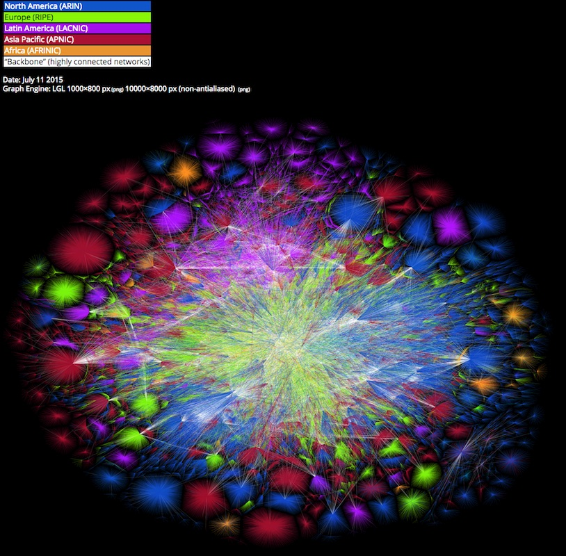

  
```{r setup, include=FALSE}
knitr::opts_chunk$set(echo = TRUE)
```

# Outline for today

- What is a network?
- Networks in `igraph`
- Reading networks into `igraph`
- Plotting networks
- Descriptive statistics of networks

# What is a network?

Networks are increasingly useful tools for analyzing how the pieces of a system interact. Given the importance of both quantitative and visualization tools for analyzing networks, R is a natural environment for network analysis. Before describing what a network is more technically, it is important to give an intuitive definition and some examples.

A network is simply a way to describe how things are connected. More specifically, a network is a collection of objects ("nodes" or "vertices") where lines ("edges") are drawn between nodes that are connected or that interact. Nodes can be of different types (e.g., males and females in a network of people) and edges can be "undirected" where connections are symmetric (e.g., people the same phone call) or "directed" where connections start at one node and stop at another (e.g., caller and receiver in a phone call). Finally, edges can be "weighted" instead of either being present or absent (e.g, the number of calls between the caller and receiver).

## Examples of networks

Many kinds of data you have seen before are actually networks. Two of the most famous examples are of course the world wide web and the internet where the former consists of websites as nodes connected by links (directed edges) and the latter of computers connected by wifi, cables, and routers.


Since its so large, the internet is difficult to visualize, but the figure below attempts to do so.



Biologists have found tremendous use for networks from gene regulatory and co-expression networks
```{r, message=FALSE, fig.cap = "Regulatory relationships in E. coli extracted from the RegulonDB database, see Kolaczyk and Csárdi, 2014, p. 117 [^1]"}
library(sand)
data(Ecoli.data)

g.regDB <- graph.adjacency(regDB.adj, "undirected")
plot(g.regDB, vertex.size=5, vertex.label=NA)
```

to social networks in animals such as dolphins where edges represent individuals who spend time together.
```{r, fig.cap = "Bottlenose dolphin community of Doubtful Sound, New Zealand [^2]"}
dolphin = read_graph("dolphins.tsv", format = "edgelist", directed = FALSE)

plot(dolphin, vertex.size=5, vertex.label=NA)
```

There are many of other kinds of biological networks that one might analyze such as protein interaction networks, epidemiological contact networks for disease transmission, and metabolic networks. Though the kinds of analyses one might perform on a network often and should depend on the biology of the network in question, there are some common properties and statistics that are often used with networks. These common analyses are part of the field of "network science".

# Networks in `igraph`

There are a number of packages in R that are useful for network visualization and analysis. One commonly used package is called `igraph` and is described nicely in the authors of the package Kolaczyk and Csárdi in the book "Statistical Analysis of Network Data with R" [^1]. You will be briefly introduced to `igraph` here.

## Creating a network

Networks are also called "graphs" and creating a small graph in `igraph` simply entails listing all of the edges where an edge is denoted by two nodes and their undirected, directed, and/or weighted connection. 
```{r}
library(igraph)

g1 = graph( edges = c(1,2, 2,3, 3,4, 4,2), directed = FALSE)
plot(g1)

g2 = graph.formula(1-2, 2-3, 3-4, 4-2)
plot(g2)
```

Above, you can see how to create the same graph in two different ways, one with the `graph` function that takes a list of edges and one with the `graph.formula` function that takes each edge as an argument. Below, you can use the structure function `str` to get a summary of each graph, 
```{r}
print_all(g1)
print_all(g2)
```

which shows that the graphs have the same list of edges. You can also create graphs with strings as node names instead of numbers
```{r}
g = graph( c("catherine", "david weis", "david weis", "jeramiah", 
             "vinnie", "jeramiah", "julie", "jessica",
             "jessica", "vinnie", "julie", "jeramiah"), 
           isolates = c("ashely", "jeremy"))

plot(g)
```

where the `isolates` arguments allows you to have unconnected nodes.

## Edge, vertex, and network attributes

Each graph object has a list of edges,
```{r}
E(g)
```

vertices,
```{r}
V(g)
```

and "adjacency matrix",
```{r}
g[] # or get.adjacency(g) or as_adjacency_matrix(g)
```

which is a matrix whose $(i,j)^{th}$ element is the strength of the edge between node $i$ and node $j$ and where zero strength is a lack of an edge.
```{r}
as.matrix(g[]) # as a normal matrix
```

Thus, undirected graphs have symmetric adjacency matrices. You can store networks as a list of edges, an adjacency matrix, or as an "adjacency list", which is a list of nodes where each element of the list is a list of other nodes that node is connected to:
```{r}
get.adjlist(g)
```

It is also simple to add attributes to the network, its edges, or its nodes. This is accomplished with the dollar sign "$" after the network object. For example, you can get the vertex names using
```{r}
V(g)$name
```
and set some attributes like "position"
```{r}
V(g)$position = c("assoc", "assoc", "assoc", "full", "assist", "assist", "assist/assoc", "assist")
vertex_attr(g)
```

# Reading networks into `igraph`

Creating networks explicitly is practical for small networks, but large networks will likely come from large data files that list edges or can the adjacency matrix. The dolphin social network was simply an edge list
```{r}
library(readr)

dlist = read_tsv("dolphins.tsv", col_names = c("From", "To"))
head(dlist)
```

Converting this edge list into a graph involves calling the `graph_from_data_frame()` function where `d` is the list of edges, which is actually a data frame:
```{r}
dg = graph_from_data_frame(d = dlist, directed = FALSE)

V(dg)

plot(dg, vertex.size=8, vertex.label=NA)
```

The *E. coli* dataset was an adjacency matrix
```{r}
str(regDB.adj)
```

and it can be turned into a graph using the `graph_from_adjacency_matrix()` function:
```{r}
eg = graph_from_adjacency_matrix(regDB.adj, mode = "undirected")

plot(eg, vertex.size=8, vertex.label=NA)
```

# Plotting networks

There are a number of other parameters that one can use in `igraph` to alter how `plot` displays the network. To see some of these, load the social network derived from dominance behavior in a colony of 62 adult female Japanese macaques (*Macaca fuscata fuscata*)[^3]. The adjacency matrix is weighted since it shows the number of dominance encounters between two individuals.
```{r, message = FALSE}
macaques = read_delim("macaques.txt", " ", col_names = FALSE)

mg = graph_from_adjacency_matrix(as.matrix(macaques), mode = "undirected", weighted = TRUE)
mg
```

From the description above, you can see that the macaques network has a `weight` attribute for the edges. You can use this to make the edges thicker and thinner. The color of the edges, the size of the nodes, and many other properties can be set directly to the graph; before, you altered the plot by adding additional parameters to the plot function itself. The `plot` function will automatically use attributes of the graph when plotting.
```{r, fig.width=10}
# set edge color, width, and curve
E(mg)$color = "blue"
E(mg)$curved = 0.15
E(mg)$width = E(mg)$weight/2

# set color of nodes
V(mg)$color = "red"

# set size of the node to its degree
V(mg)$size = degree(mg)/6

# get rid of vertex labels
V(mg)$label = NA
  
plot(mg)
```

## Network layouts

If you have tried plotting the same graph with exactly the same options, you might have noticed that the layout of the nodes and edges changes slightly every time. The reason for this is that `igraph` uses an algorithm to figure out how to layout the nodes and edges and that algorithm has some randomness built in. The `layout` argument to `plot` tells `igraph` which algorithm to use.
```{r, fig.width=10}
plot(mg, layout = layout_in_circle(mg), edge.width = 0.5)
```

The argument to `layout` just a list of coordinates for each node,
```{r}
head(layout_in_circle(mg))
```
which means that you can technically place the nodes however you like.

The fancy algorithms for layout typically work by treating the nodes as balls and the edges as springs and trying to calculate the positions of the nodes such that nodes with more edges or connections are pulled in more different directions. A couple popular algorithms are the "Fruchterman–Reingold" (`layout_with_fr`) and "Kamada and Kawai" (`layout_with_kk`) methods.
```{r, fig.width=10}
plot(mg, layout = layout_with_fr(mg))
```

For larger graphs, the `layout_with_lgl` apparently works a little better.
```{r, fig.width=10}
plot(mg, layout = layout_with_lgl(mg))
```

# Descriptive statistics of networks

## Degree distribution

The most common quantitative measure of a network is its **degree distribution** where the degree of a node is how many edge connect to it. Much of "network science" begins with studying how different simple models that generate networks can also generate different classes of degree distributions. To say more about this is quite beyond the scope of this course, but for more see the book by Kolaczyk and Csárdi referenced above. Calculating and plotting the degree distribution is simple using `degree()` to calculate the degrees of every node but then plotting it with `ggplot` means you have to convert it to a data.frame:
```{r message=FALSE}
library(tidyverse)
theme_set(theme_bw())

degree(mg)

ggplot( data.frame( degree = degree(mg) ) ) + geom_histogram(aes(x = degree)) 
```

## Centrality

One way to measure how important different nodes are is to calculate some measure of their "centrality". The degree of a node is the simplest measure of its centrality. Another measure is the "closeness centrality", which measures how close (in terms of number of hops across other nodes) a node is to all other nodes.
```{r}
ggplot( data.frame( closeness = closeness(mg) ) ) + geom_histogram(aes(x = closeness))
```

"Betweenness" centrality measures the extent to which a vertex is located ‘between’ other pairs of vertices.
```{r}
ggplot( data.frame( betweenness = betweenness(mg) ) ) + geom_histogram(aes(x = betweenness))
```

Finally, "eigenvector" centrality measures how central a node is by how central the nodes are that are connected to it. This measure of centrality is very closely related to the original Google "PageRank" measure that Google used to rank websites for search.
```{r}
ggplot( data.frame( eigen_centrality = eigen_centrality(mg)$vector ) ) + geom_histogram(aes(x = eigen_centrality))
```


# Lab 

### Problems

1. Use the data file "rugosa_social_network.csv", which describes the social network of the sleepy lizard (*Tiliqua rugosa*)[^4] as an adjacency matrix 
    - Read in the file (hint: you may need to be careful with which function and/or parameters you use here to get the matrix right)
    - Plot the social network of the sleepy lizard
    - Make the node size proportional to the eigenvalue centrality of the node
    - What is the degree of the most highly connected lizard? Are there multiple lizards with this max degree?
    
2. Identify the dataset that you would like to use for your lightning talk
    - Briefly describe the data
    - Briefly describe each of the three figures you would like to make with these data
    - Identify any major hurdles to wrangling or plotting these data
    - You may change alter your dataset and figures for the final lightning talk, but use this as an opportunity to identify serious candidate dataset and figures.


[^1]: Kolaczyk, Eric D. and Csárdi, Gábor. 2014. Statistical Analysis of Network Data with R. Springer, New York, NY. <http://dx.doi.org/10.1007/978-1-4939-0983-4>. Github: <https://github.com/kolaczyk/sand>.

[^2]: Lusseau, David, Schneider, Karsten, Boisseau, Oliver J., Haase, Patti, Slooten, Elisabeth, and Dawson, Steve M.. 2003. The bottlenose dolphin community of Doubtful Sound features a large proportion of long-lasting associations. Behav Ecol Sociobiol 54:396--405. <http://dx.doi.org/10.1007/s00265-003-0651-y>. Data at <http://konect.uni-koblenz.de/networks/dolphins>.

[^3]: Takahata, Yukio. 1991. Diachronic changes in the dominance relations of adult female Japanese monkeys of the Arashiyama B group. The Monkeys of Arashiyama. State University of New York Press, Albany, pp 123--139. Data from <http://konect.uni-koblenz.de/networks/moreno_mac>.

[^4]: Bull, C. M., Godfrey, S. S., and Gordon, D. M.. 2012. Social networks and the spread of Salmonella in a sleepy lizard population. Mol Ecol 21:4386--4392. <http://dx.doi.org/10.1111/j.1365-294X.2012.05653.x>

