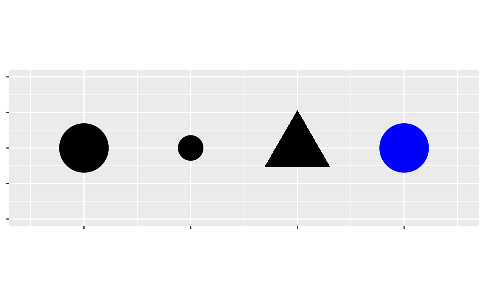

```{r setup, include=FALSE}
knitr::opts_chunk$set(echo = TRUE)
```

# Outline for today

- Plotting with R `base` graphics (sucks!)
- Basic plotting with `ggplot2`

# Plotting with R `base` graphics

Why do you even want to plot things?

<!-- Crowdsource! -->
- 

The base package (basic functions included with R and automatically loaded) includes plotting functions that can be useful. As you will quickly see however, the limits of these functions become evident quickly and more advanced plotting functions are required. The package of functions we will use come from Hadley Wickham's `ggplot2`.

Before plotting, you need some data. A common dataset used in data exploration courses in R is the "Gapminder" data, which is a collection of time series data for countries.
```{r}
library(gapminder)
library(dplyr)
glimpse(gapminder)  # like a better version of `str()`, sorta
```
The data covers the statistics listed above for
```{r}
str(gapminder$country)
```
142 countries.

First, plot how life expectancy has changed over the years
```{r}
plot(gapminder$year, gapminder$lifeExp)
```

You can modify the axis labels by adding the `xlab` and `ylab` arguments and give the plot a title with the `main` argument.
```{r}
plottitle = "Life expectancy over time for all countries in the Gapminder data" # save space in the code
plot(gapminder$year, gapminder$lifeExp, 
     xlab = "Year", ylab = "Life expectancy", main = plottitle)
```

Though there is a clear trend observable even at this scale, increasing life expectancy with time, but does this hold for individual countries? To see this, you could slice just a single country out of the data. Using the United States, for example,
```{r}
us = filter(gapminder, country == "United States")
plot(us$year, us$lifeExp, 
     xlab = "Year", ylab = "Life expectancy", main = plottitle)
```

When plotting a couple of countries together, you can color the points by country by using the `col` argument to `plot`:
```{r}
usukjpcn = filter(gapminder, 
            country == "United States" 
            | country == "United Kingdom" 
            | country == "Japan" 
            | country == "China" )

plot(usukjpcn$year, usukjpcn$lifeExp, 
     xlab = "Year", ylab = "Life expectancy", main = plottitle,
     col = usukjpcn$country)

legend('bottomright', legend = levels(usukjpcn$country), col = 1:4, pch = 1)
```

Uh oh, the legend includes all the countries! This is because slicing the data doesn't dropped unused factor levels. Dang. You can fix this using the `droplevels()` function
```{r}
usukjpcn = droplevels(usukjpcn)
plot(usukjpcn$year, usukjpcn$lifeExp, 
     xlab = "Year", ylab = "Life expectancy", main = plottitle,
     col = usukjpcn$country)

legend('bottomright', legend = levels(usukjpcn$country), col = 1:4, pch = 1)
```

So far, the basic `plot()` function is pretty useful. To see its limits, you can try something that **shouldn't** be that much harder: plotting these data as points connected by a line. At first pass, you could try giving the `plot()` function the `type = "l"` argument to indicated you want lines.
```{r}
plot(usukjpcn$year, usukjpcn$lifeExp, 
     xlab = "Year", ylab = "Life expectancy", main = plottitle,
     type = 'l')
```

However, while `plot()` could color points by country, it doesn't make individual lines for each country and simply makes one connected line. Getting around this in the basic `plot()` function is tedious. One way involves using the `lines()` function to indicate specifically each line you want. 
```{r}
# make an empty plot. lame.
plot(0:0, xlim = c(1952, 2007), ylim = c(20, 85), 
     xlab = "Year", ylab = "Life expectancy", main = plottitle, type = "n") 

# make each line individually. again, lame.
lines(filter(usukjpcn, country == "United States")$year, 
     filter(usukjpcn, country == "United States")$lifeExp) 
lines(filter(usukjpcn, country == "United Kingdom")$year, 
     filter(usukjpcn, country == "United Kingdom")$lifeExp)
lines(filter(usukjpcn, country == "Japan")$year, 
     filter(usukjpcn, country == "Japan")$lifeExp) 
lines(filter(usukjpcn, country == "China")$year, 
     filter(usukjpcn, country == "China")$lifeExp)
```

That was quite tedious. Another way would be to have individual plots for each line.
```{r}
par(mfrow=c(1,5))
plot(filter(usukjpcn, country == "United States")$year, 
     filter(usukjpcn, country == "United States")$lifeExp, 
     xlab = "Year", ylab = "Life expectancy", main = plottitle,
     type = 'l')
plot(filter(usukjpcn, country == "United Kingdom")$year, 
     filter(usukjpcn, country == "United Kingdom")$lifeExp, 
     xlab = "Year", ylab = "Life expectancy", main = plottitle,
     type = 'l')
plot(filter(usukjpcn, country == "Japan")$year, 
     filter(usukjpcn, country == "Japan")$lifeExp, 
     xlab = "Year", ylab = "Life expectancy", main = plottitle,
     type = 'l')
plot(filter(usukjpcn, country == "China")$year, 
     filter(usukjpcn, country == "China")$lifeExp, 
     xlab = "Year", ylab = "Life expectancy", main = plottitle,
     type = 'l')
```

That was also very tedious. Not only that, notice that the y-axes have different ranges, which makes comparison across countries difficult. Correcting for this and other issues adds to the tedium. Using `ggplot2` to create these kind of plots is much easier.

# Basic plotting with `ggplot2`

The `ggplot2` package is built on the idea that graphics have can have a "grammar", or set or rules, that specifies how they can and should be constructed. Implementing these rules not only makes creating graphics easier, but it makes such graphics consistent and clear. Wickham borrows this idea from the book, "The Grammar of Graphics"" by Wilkinson, Anand, and Grossman (2005)[^1]. While this structure may seem a bit artificial at first, it makes creating graphics very modular and building up complex graphics much easier.

To understand how `ggplot2` works, first consider the following example replicates your life expectancy by year plot above:
```{r}
library(ggplot2)
ggplot(data = gapminder) + 
  geom_point(mapping = aes(x = year, y = lifeExp))
```

The first line has the function `ggplot`, which creates a coordinate system for the plot that you can add "layers" to. The argument to `ggplot` indicates which dataset to use. 

Adding layers is accomplished by "adding" to the base plot with "+" and additional features. The first feature added above is `geom_point()`, which adds a layer of points and creates a scatter plot. `ggplot2` comes with many other "geometries", which are really just other kinds of visual objects, like lines and boxes.

Each `geom()` function takes a `mapping` argument that defines how variables map to the visual objects in the plot. The `mapping` argument is always paired with the `aes()` function, which stands for "aesthetics", and the `x` and `y` arguments of `aes()` specify which variables correspond to which axis.

## Aesthetic mapping with `aes()`

In addition to the `x` and `y` axes, you can map variables to the color of the point. Above, you did this using the `country` variable. Now, repeat this with `ggplot()`.
```{r}
ggplot(data = usukjpcn) + 
  geom_point(mapping = aes(x = year, y = lifeExp, color = country))
```

The above code with `ggplot2` is both simpler and easier to read than the code creating the similar plot with the basic `plot()` function.

Color is just one additional "aesthetic". Others include the size and shape of the point. 


For example, you can make the size of the point proportional to the population:
```{r}
ggplot(data = usukjpcn) + 
  geom_point(mapping = aes(x = year, y = lifeExp, color = country, size = pop))
```

You are now ready to recreate the multiline plot from above.
```{r}
ggplot(data = usukjpcn) + 
  geom_line(mapping = aes(x = year, y = lifeExp, color = country))
```

The only change you had to make was to change `geom_point` to `geom_line`, for a line plot. Easy peasy.

## 

Finally, `ggplot2` makes creating multiple plots very easy with "facets", which are just subplots that each correspond to a specific value of a variable or more generally to a specific subset of the data. To add facets in using `ggplot()`, you need the `facet_wrap()` function. In the multiple plots created above with the basic graphics, the variable was country and each plot was the subset of data for each of the four countries. For example, with `ggplot()`,
```{r}
ggplot(data = usukjpcn) + 
  geom_line(mapping = aes(x = year, y = lifeExp, color = country)) +
  facet_wrap(~ country)
```

The first argument to `facet_wrap()` is a "formula", which refers to how one writes regression formulas using R's regression function `lm()`. Essentially, the "~" is like an equals sign for a regression formula and the variables on the right hand side are dependent variables. The variables passed to `facet_wrap` should be discrete (like factors).

Adding an additional facet is possible to make a grid of plots. To see an example, load the genomic imprinting data from the Babak et al. (2015) study (this time in tidy format),

```{r}
library(readr)
imprint = read_csv("babak-etal-2015_imprinted-mouse_tidy.csv", na = "NA")
```
and plot a histogram of the expression values for a subset of the data (four genes and four tissues)
```{r}
fourgenes = filter(imprint, 
                   (Genes == "IGF2" | Genes == "GRB10" | Genes == "MEG2" | Genes == "PEG3") &
                     (tissue == "Preoptic Area (ref)" | tissue == "Hypothalamus" | 
                     tissue == "e17.5 Brain" | tissue == "e9.5 Yolk Sac" ))
ggplot(data = fourgenes, aes(expression)) +
  geom_histogram() +
  facet_grid(Genes ~ tissue)
```

Here, `facet_grid` arranges the plots nicely in a grid. Positive values of expression indicate expression from the paternal chromosome only and negative values from the maternal chromosome. Thus, this plot shows how some genes are "imprinting" differently depending on the tissue type.

[^1]: see the Canvas course site for a copy of the book


# Lab 


### Problems

1. Use recent polling data (`USPresPolls_538dotcom_28Sep2016.csv`): 
    - Create a plot with `ggplot()` that shows the `adj_pct` for both Clinton and Trump for the "now" `polltypeA`
    - Use both points and lines connecting those points
    - Make Clinton and Trump data each a different color
    - Make the size of the points in proportion to the weighting each poll gets in the FiveThirtyEight model (given in column `wtnow`)
    
2. Use the `gapminder` data:
    - Create a line plot with `ggplot()` that shows life expectancy on the y-axis and time on the x-axis.
    - Make each line represent a **country**   
    (hint: use Google to figure out how to tell `ggplot` to group the data appropriately)
    - Color each line by the **continent**
    - Make points whose size is proportional to GDP per capita (variable `gdpPercap`)
    
3. Create a plot like the one in Problem 2 
    - Except, the new plot has multiple subplots where each subplot is  a different continent. 
    - Color the points where countries at that year had greater than 50 million people.  
    (hint: again, Google is your friend)
