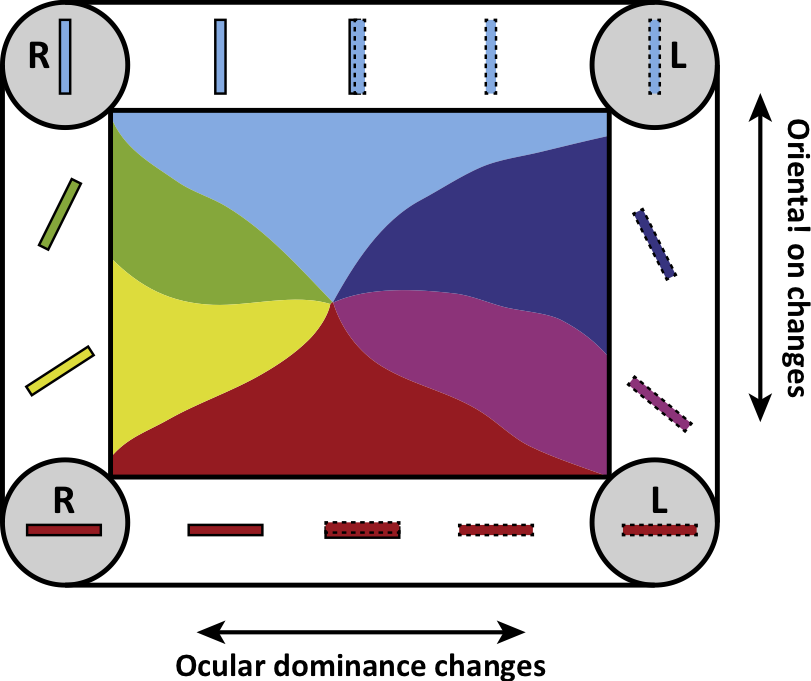
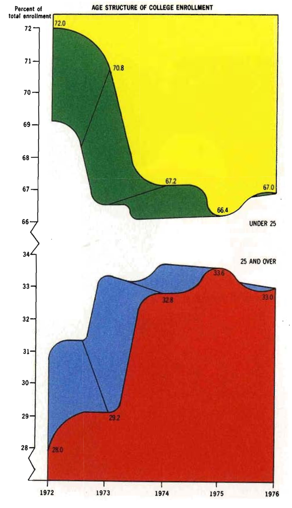
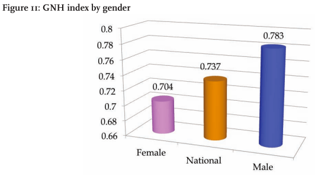

  
```{r setup, include=FALSE}
knitr::opts_chunk$set(echo = TRUE)
```

# Outline for today

- Reminders
- Principles of displaying data
- Modifying plot elements
- Themes

# Reminders

1. Start thinking about data to use and plots to make for lightning talk. Feel free to e-mail me if you want to run your ideas by me.

# Principles of displaying data

While there is a lot of art in designing figures to display data, there is also some science. Researchers interested in designing effective figures have found some helpful rules of thumb that take advantage of simple intuitions as well as empirical results from psychology and neuroscience.

## More data. Less ink.

In his book, "The Visual Display of Quantitative Information"[^1], Edward Tufte states that

> Data-ink is the non-erasable core of the graphic, the non-redundant ink arranged in response to variation in the numbers represented

and emphasizes that the "redundant data-ink" should be minimized. In other words, use as few visual elements as necessary to display your data. For example, a bar chart simply shows the relative magnitude of different factors, and thus needs only bars lined up next to one another for visual comparison. Yet, many bar charts come with "chart junk", which are elements that are unnecessary for displaying the data. The example below shows how removing "chart junk" can make a bar chart much simpler, easier to read, and even more attractive (at least in terms of elegance and simplicity).


This rule can and should be applied to tables as well. The example below shows how removing the chart junk from the table can make it visually much simpler and easier to read without losing the ability to easily distinguish rows or compare across columns. The example also displays some useful rules for tables, such as removing unnecessary horizontal lines, aligning text and numbers correctly, and using row spacing to help distinguish rows.


## Visual properties of graphical elements

Nobel prize-winning work in neuroscience by David Hubel and Torsten Wiesel (among others) showed that the visual cortex is designed to recognize certain basic visual features, such as orientation and contrast that distinguishes edges. These basic features are then assembled into more complex visual objects in other brain regions. Knowing that some visual features may be more "basic" than others with respect to how they are processed by the brain means that you can leverage those features to make graphics easier to read.



An example of how some visual elements are more basic than others comes from the work by William Cleveland and Robert McGill on the speed and accuracy that people have in distinguishing specific graphical elements [^2]. The table below shows these elements and their rank from most to least accurately distinguishable.

|Rank | Graphical element |
|-----+-------------------|
| 1   | Positions on a common scale |
| 2   | Positions on the same but nonaligned scales |
| 3   | Lengths |
| 4   | Angles, slopes |
| 5   | Area |
| 6   | Volume, color saturation |
| 7   | Color hue |

The figure below gives you a sense of what each of these elements are.


As an example, a pie chart, which uses angles to indicate the relative size of a category, can be harder to read than a bar chart, which uses positions on a common scale


## Gestalt principles

Gestalt ("shape" in German) principles come from German psychologists in the early 20th century who tried to come up with the rules for perception. These rules are built on common sense intuitions and can be useful in composing figures, particularly with respect to grouping related parts of a figure. The general rule is that objects that look alike, are close to one another, connected by lines or enclosed together belong together somehow.

1. **Similarity**. Objects with similar color, shape, or orientation are grouped together. 


2. **Proximity**. Objects close to each other are grouped together.


3. **Connection**. Objects linked to each other are grouped together.
4. **Enclosure**. Objects enclosed together are grouped together.


## (Bad) Examples

In "The Visual Display of Quantitative Information", Tufte said of this graphic

> This may well be the worst graphic ever to find its way into print"



Here is another example to get one's blood boiling from (ironically) a 2012 report on "World Happiness".



# Modifying plot elements

With all the basic tools of `ggplot2`, you can already implement many of the visual design principles described above. The remaining changes you might need to make include altering the **labels**, **annotations**, **coordinate system or scaling**, **color scaling**, or **plot size**.

## Labels

You have already seen how to add simple labels to simple plots, but now you will add labels to `ggplot2` plots. Adding labels in `ggplot2` is accomplished with the `labs()` function. For example, if you load and plot the recent polling data, you can add a title easily

```{r, message = FALSE}
library(tidyverse)

polls = read_csv("president_general_polls_2016.csv")

# make polls tidy...and choose only one polling model ("polls-plus")
tpolls = 
  polls %>% 
  filter(type == "polls-plus") %>%
  gather(key=candidate, value=poll, rawpoll_clinton, rawpoll_trump, rawpoll_johnson, adjpoll_clinton, adjpoll_trump, adjpoll_johnson) %>% 
  separate(candidate, into=c("poll_type", "candidate"), sep="poll_")

# get a manageable subset of polls
tpollsUS2016a = tpolls %>% filter(startdate > "2016-07-01", poll_type == "adj", state == "U.S.", grade %in% c("A", "A-", "A+", "B+"))
tpplot = tpollsUS2016a %>% ggplot(aes(x=startdate, y=poll, color=candidate))
tpplot + geom_point(alpha = 0.3) + 
  geom_smooth(lwd = 1.5, span = 0.1) +
  labs(title = "2016 Presidential Election Polling Data")
```

You can also add a `subtitle`, which is additional detail below the title, and a `caption`, which should describe the data in the plot. These features are only available in `ggplot` 2.2.0 and higher.

```{r, eval=FALSE}
tpplot + geom_point(alpha = 0.3) + 
  geom_smooth(lwd = 1.5, span = 0.1) +
  labs(title = "2016 Presidential Election Polling Data",
       subtitle = "Only high quality polls included",
       caption = "Despite Trump's Electoral College victory, polling never really put him ahead")
```

Labels can also be added to the axes and the legend.

```{r}
tpplot + geom_point(alpha = 0.3) + 
  geom_smooth(lwd = 1.5, span = 0.1) +
  labs(title = "2016 Presidential Election Polling Data",
       x = "Date", y = "Adjusted polling percentage", color = "Candidate")
```

Mathematical symbols can be added by using `quote()` instead of the quotation characters "". Check `?plotmath` for options. For example,

```{r}
tpplot + geom_point(alpha = 0.3) + 
  geom_smooth(lwd = 1.5, span = 0.1) +
  labs(title = quote(integral(f(x)*dx, a, b)),
       x = quote(x[y]^z),
       y = quote(frac(y,x) == frac(alpha, beta)))
```


## Annotations

Adding annotations to plots can be very important and people often do this in programs such as Adobe Illustrator. However, taking the plot to another program makes generating the figure much more complicated and breaks the "reproducible science" method using RMarkdown where any change in the data should easily be converted into updated figures and documents.

One way to add text to a plot is with `geom_text`, which is like `geom_point`, but has a `label` option. For example, you can label the maximum polling percentages for each candidate. The code below first groups the data by choice, since you want to use a label for each candidate. Then, it filters the rows to include only the ones that rank first when sorted into descending order based on `adj_pct`. Finally, it uses this data table for the `geom_text`.

```{r}
maxpolls = tpollsUS2016a %>% group_by(candidate) %>% filter(row_number(desc(poll)) == 1)

tpollsUS2016a %>% ggplot(aes(x=startdate, y=poll)) +
  geom_point(aes(color=candidate), alpha = 0.3) + 
  geom_smooth(aes(color=candidate), lwd = 1.5, span = 0.1) +
  geom_text(aes(label = c("Clinton max", "Trump max", "Johnson max")), data = maxpolls)
```

Often, you may want to put a piece of text in a specific location in the plot. You need to create a new data table for this that has the right names for the x and y variables. This is because `ggplot2` **only** understands how to plot dataframes, not other things. This is both the source of its power and limitations. For reference, `tibble` is the `tidyverse` function for easily creating dataframes.

```{r}
library(lubridate)
label = tibble(startdate = ymd("2016-09-01"), poll = 25, candidate = "clinton", label = "This is a label in the middle of the plot")

tpollsUS2016a %>% 
  ggplot(aes(x=startdate, y=poll)) +
  geom_point(aes(color=candidate), alpha = 0.3) + 
  geom_smooth(aes(color=candidate), lwd = 1.5, span = 0.1) +
  geom_text(aes(label = label), data = label, vjust = "bottom", hjust = "center")
```

The text has a "justification" in reference to the (x,y) location of the point you specify. You can set the vertical (`vjust`) and horizontal (`hjust`) justication above using the options below. By setting "top" and "right" as above, the coordinate is at the top and right of the text, which means the text is below and to the left of the point.


## Coordinate systems

Coordinate systems in `ggplot2` can be complex, but usually you will only want to flip the `x` and `y` axes with `coord_flip()` as in previous examples.

```{r}
tpplot + geom_point(alpha = 0.3) + 
  geom_smooth(lwd = 1.5, span = 0.1) +
  coord_flip()
```

There is a coordinate system for "polar" coordinates that effectively produces a pie chart. Since pie charts are bad (see above), avoid this unless your data really are in polar coordinates.

You can use a coordinate transform to put the `x`, `y`, or both axes on a log scale. The function to accomplish this is `coord_trans()` where function names are given for the `x` and `y` arguments (e.g, `log10`).

```{r}
library(gapminder)

ggplot(gapminder, aes(x = gdpPercap, y = lifeExp)) + 
  geom_point(aes(color = continent)) +
  geom_smooth(method = "lm") +
  coord_trans(x = "log10", y = "log10")
```

Above, you can notice that the straight line (since "lm" was used to plot the line) is curved, which indicates that the line was fit on the untransformed data (i.e., a straight line plotted on a log-log plot is curved). Below, you will see how to change the scales to a log scale so that the line is fit on the transformed data.

## Scales 

Scales control how the data maps to aesthetics, which includes whether the data is on an arithmetic or log scale, how data maps to colors, and how the scale values themselves are displayed (i.e., the tick marks). By default, `ggplot2` takes the scatter plot below

```{r, eval = FALSE}
ggplot(gapminder, aes(x = gdpPercap, y = lifeExp)) + 
  geom_point(aes(color = continent)) 
```

and adds

```{r, eval = FALSE}
ggplot(gapminder, aes(x = gdpPercap, y = lifeExp)) + 
  geom_point(aes(color = continent)) +
  scale_x_continuous() +
  scale_y_continuous() +
  scale_colour_discrete()
```

You can alter properties of these scales including where tick marks are, the labels of those marks, etc. Modifying the x-tick spacing and getting ride of the y-labels looks like this:

```{r}
ggplot(gapminder, aes(x = gdpPercap, y = lifeExp)) + 
  geom_point(aes(color = continent)) +
  scale_x_continuous(breaks = seq(10000, 100000, by = 10000)) +
  scale_y_continuous(labels = NULL)
```

Changing the scales to log values can be done with the `scale_x_log10` and `scale_y_log10` functions.

```{r}
ggplot(gapminder, aes(x = gdpPercap, y = lifeExp)) + 
  geom_point(aes(color = continent)) +
  scale_x_log10() +
  scale_y_log10() +
  geom_smooth(method = "lm")
```

Above, you can see that the fit "lm" line is straight, which means it was applied to the transformed data.

Finally, you can change the color scale for the discrete variables plotted. One common alternative set of color scales are the "ColorBrewer" (<http://colorbrewer2.org/>) scales that are designed to work well with color blind folks and can be loaded with `library(RColorBrewer)`.

```{r}
library(RColorBrewer)

ggplot(gapminder, aes(x = gdpPercap, y = lifeExp)) + 
  geom_point(aes(color = continent)) +
  scale_x_log10() + scale_y_log10() +
  scale_colour_brewer(palette = "Dark2")
```

You can also set the color scale manually, which is nice for making Hillary polls blue and Trump polls red.

```{r}
tpplot + 
  geom_point(alpha = 0.3) + 
  geom_smooth(lwd = 1.5, span = 0.1) +
  scale_colour_manual(values = c(clinton = "blue", trump = "red", johnson = "gold"))
```

### Zooming

You can "zoom" by either taking a subset of the data and plotting that or by changing the x and y limits in the coordinate system. The latter option is better for really "zooming" into a region whereas the former is better when you care only about that subset. To do the latter,

```{r}
ggplot(gapminder, aes(x = gdpPercap, y = lifeExp)) + 
  geom_point(aes(color = continent)) +
  coord_cartesian(xlim = c(1000, 2000), ylim = c(50, 70))
```

# Themes

More generally, you can modify non-data elements of the plot with a theme. There are eight themes included with `ggplot2`:


Applying them just requires adding the specific function:

```{r}
tpplot + 
  geom_point(alpha = 0.3) + 
  geom_smooth(lwd = 1.5, span = 0.1) +
  scale_colour_manual(values = c(clinton = "blue", trump = "red", johnson = "gold")) +
  theme_bw()
```

Hadley Wickham has some text defending the default theme with the gray background. I won't detail his reasons since I think that theme is frankly ugly and the gray background is "chart junk". 

## Claus O. Wilke theme (`cowplot`)

Claus O. Wilke, an evolutionary biologist at UT Austin, has put together a theme that he describes as

> a publication-ready theme for ggplot2, one that requires a minimum amount of fiddling with sizes of axis labels, plot backgrounds, etc.

Once you load the package, the theme becomes the default.

```{r}
library(cowplot)

tpplot + 
  geom_point(alpha = 0.3) + 
  geom_smooth(lwd = 1.5, span = 0.1) +
  scale_colour_manual(values = c(clinton = "blue", trump = "red", johnson = "gold"))
```

The theme is meant to work well with saving figures (coming in another class session), adding annotations (`cowplot` does not require creating a data table), and placing subplots in arbitrary arrangements in the plot. For more information, check out <https://cran.r-project.org/web/packages/cowplot/vignettes/introduction.html>.

[^1]: Tufte, E.R. "The Visual Display of Quantitative Information". Graphic Press: Cheshire, Connecticut (2001).
[^2]: Cleveland, W.S. & McGill, R. *Science* **229**, 828–833 (1985).

# Lab 

### Problems

1. Create a plot from any of the datasets we have used previously that includes the following
    a. Use color to represent the value of some variable in the data
    b. Descriptive labels for the axes and title
    c. Appropriate tick mark breaks and labels (only if defaults are bad)
    d. Non-ggplot2 default theme (pick your favorite)
    e. Bonus 2 points: change color of the x and y tick labels to blue
    
2. Find a bad figure in a scientific paper in your field
    a. Save the figure and include it as a .jpg or .png with your .Rmd and load the figure into your .Rmd file as an image.
    b. Describe what is wrong with the figure using graphics principles discussed today.
    c. Describe how you would fix the figure.
    d. Bonus 5 points: load in the data and actually fixing the figure!
